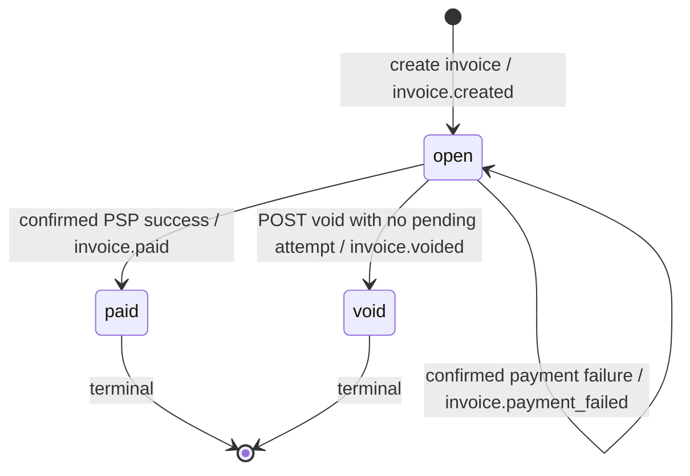

# Invoice and Payment Service Design

This service favors recoverable payment outcomes over a synchronous payment response. `POST /pay` commits one pending attempt and returns its ID immediately. A worker contacts the mock PSP using that ID as the PSP idempotency key, then persists the result. The API and PSP are separate Rust processes. Both use one PostgreSQL container for a small local demo, but the API only observes PSP charges through HTTP.

## 1. Data model

The complete field-level Mermaid model and constraints are in [ER.md](ER.md).

`businesses` own the tenant-scoped records. Composite foreign keys prevent cross-business customer/invoice references. An invoice has one or more items with positive integer quantity and unit price. The API computes `BIGINT total_cents` with checked arithmetic; it rejects client-supplied totals and uses no floating-point money.

`payment_attempts` stores caller idempotency and the original accepted response for exact replay. `psp_charges` is mock-PSP-owned, addressed through HTTP by the stable attempt UUID rather than by a cross-service foreign key.

`events` is an immutable, business-scoped stream; each event has a delivery row per active endpoint. The event's ordered ID supports reconciliation; delivery retries cannot mutate the event.

Key and index choices by table (field shapes and foreign keys are in [ER.md](ER.md)):

- `businesses`: UUID primary key; no secondary index. This is the tenant root.
- `api_keys`: UUID primary key; unique prefix and SHA-256 hash. Hash lookup avoids storing the bearer secret; prefix aids revocation.
- `customers`: UUID primary key; `(business_id, created_at, id)` list index and `(business_id, id)` uniqueness. Tenant-scoped lookup is explicit.
- `invoices`: UUID primary key; `(business_id, state, created_at, id)` list index and `(business_id, id)` uniqueness. State filtering remains tenant-scoped.
- `invoice_items`: UUID primary key; `invoice_id` index for detail reads. Prices stay on items rather than an opaque total alone.
- `payment_attempts`: UUID primary key shared with PSP; unique tenant/idempotency key, partial unique pending-invoice index, and status/due index. This separates retries from invoice state.
- `psp_charges`: attempt UUID primary key with no cross-service foreign key. One durable mock charge per attempt makes lookup and duplicate suppression explicit.
- `webhook_endpoints`: UUID primary key and unique `(business_id, id)` for tenant ownership. The active flag controls future delivery creation.
- `events`: identity `BIGINT` primary key and `(business_id, id)` cursor index. Ordered replay is simpler than paging by UUID.
- `webhook_deliveries`: UUID primary key, unique `(event_id, endpoint_id)`, and status/due index. Delivery retries remain separate from immutable events.

At 100 times the volume I would use keyset pagination for customer and invoice lists, partition older event and delivery rows, separate PSP storage, and scale workers using the existing lease and `SKIP LOCKED` claims.

## 2. Invoice state machine

Only `open`, `paid`, and `void` are stored invoice states. An invoice is created ready to pay; `open` means the amount is still owed. A pending attempt is represented in `payment_attempts`, while the invoice remains open. A confirmed decline marks that attempt failed but leaves the invoice open for a new attempt; a timeout does not itself change either state. `paid` and `void` are terminal and no transition is reversible: refunds and reissuing are outside this assignment. Draft and uncollectible states would add workflows that this API does not offer. The pay and void handlers lock the invoice row, check its current state and pending attempt, and return `409` for invalid operations. A new key on a paid invoice gets `invoice_already_paid`; a duplicate of the original key still replays its original `202` response, not the current attempt status.

## 3. Payment correctness and failure modes

The pay handler first checks for an existing key. For a new key it locks the invoice using `SELECT ... FOR UPDATE`, verifies it is open with no pending attempt, inserts one attempt, and commits. It never holds a database transaction while calling the PSP. I chose a row lock because the invariant is per invoice and the waiting request can simply recheck state. Advisory locks require a separate key convention; serializable isolation adds retries; an optimistic update alone does not clearly reserve the external operation. The unique partial index is a database backstop.

Two simultaneous pay calls with different keys serialize on the invoice row. One creates a pending attempt; the other returns `409 payment_in_progress`. Same-key calls resolve to the same attempt and stored `202` response. The PSP sees at most one stable attempt ID. On `tok_timeout`, the API has already returned `202`; the worker's two-second PSP call times out. The mock PSP records success **before** delaying its first response for 30 seconds, so the worker's immediate `GET /charges/{attempt_id}` can find success after roughly two seconds; the attempt need not remain pending for 30 seconds. Until success is confirmed, the attempt stays pending and the invoice stays open. The caller polls `GET /payment-attempts/{id}` and may also receive `invoice.paid`.

If the PSP succeeds and the API crashes before persisting it, the attempt is still pending. After the worker lease expires, another run asks the PSP for that attempt ID, sees the existing charge, and finishes the invoice transaction. A retry with the same ID cannot create another mock charge. This guarantee requires durable idempotency and lookup at the PSP; our database lock alone cannot make an external charge exactly once. If the PSP is unavailable or gives no definitive answer, we leave the attempt pending and block another payment rather than risk a duplicate charge. The worker retries with a capped delay.

A reused idempotency key is checked against a SHA-256 hash of canonical invoice ID and token. An identical request replays its original `202`; a different body returns `409 idempotency_key_reused`. A new pay request on a paid or void invoice returns `409` without creating an attempt. A confirmed decline or mock network failure marks only that attempt failed, leaves the invoice open, and allows a later payment with a new key.

## 4. Webhook design

The invoice transaction inserts the event and a delivery row for each active endpoint. The worker sends the serialized JSON bytes with `X-Dodo-Event-Id`, `X-Dodo-Timestamp`, and `X-Dodo-Signature`. The signature is `v1=` plus hex HMAC-SHA256 over `timestamp + "." + event_id + "." + raw_body`, keyed by the endpoint secret. Receivers should compare signatures in constant time, reject timestamps more than five minutes away, and deduplicate event IDs. A fresh timestamp and signature are generated for each retry; the event ID and payload do not change.

There are six attempts: immediately, then after 5 seconds, 30 seconds, 2 minutes, 10 minutes, and 1 hour. The final attempt starts about 72 minutes 35 seconds after the first failure, excluding HTTP/request-processing time. A delivery that still fails is marked `exhausted` and retained; there is no automatic replay endpoint. A business calls `GET /events?after_id=<last_processed_id>` to reconcile missed events. Delivery never blocks an invoice or payment API response. The worker claims rows with short leases and `FOR UPDATE SKIP LOCKED`, commits, sends HTTP with a two-second deadline, then records success or schedules a retry. In production I would restrict webhook destinations to prevent requests to private network addresses and encrypt signing secrets with managed keys.

## 5. API key model

New keys contain 32 random secret bytes and a short visible prefix. The API stores only SHA-256 of the complete key, plus its business, prefix, issue time, and optional revocation time. A high entropy key is safe to hash directly; password-style slow hashing is unnecessary. Clients transmit it as `Authorization: Bearer` over TLS. The local Compose demo uses a fixed, explicitly nonproduction key for one-command setup. A newly issued key is returned once. Rotation is issue-new, migrate clients, then revoke-old. Middleware looks up only active hashes and supplies `business_id`; every resource query is business scoped. A leaked key exposes only that business's API surface, and its prefix lets operators locate and revoke it without logging the full key.

## 6. What I cut and why

I did not build subscriptions, refunds or partial payments, tax and currency conversion, a frontend, or email. Each would add state or external dependencies without improving the required payment correctness exercise. I also omitted draft invoices and automatic collections states: invoices are created ready to pay. The demo sink logs webhooks rather than storing a receiver-side inbox.

I omitted Sonyflake/UUIDv7-style ID generation: one database does not need
cross-region ID coordination, while clock/sequence handling adds complexity.
I would revisit index locality if write volume justified it.

## 7. Production readiness gap

First, observability needs correlated tracing and alerts for aged pending payments, exhausted webhooks, PSP latency, and reconciliation lag. Second, security needs managed secret storage, TLS enforcement, private-address rejection for webhook URLs, and rate limits. Third, operations need a real PSP contract for idempotency and status lookup, explicit manual review of unresolved attempts, and an audited replay process. These are documented boundaries of the take-home, not claims that the demo is production ready.
