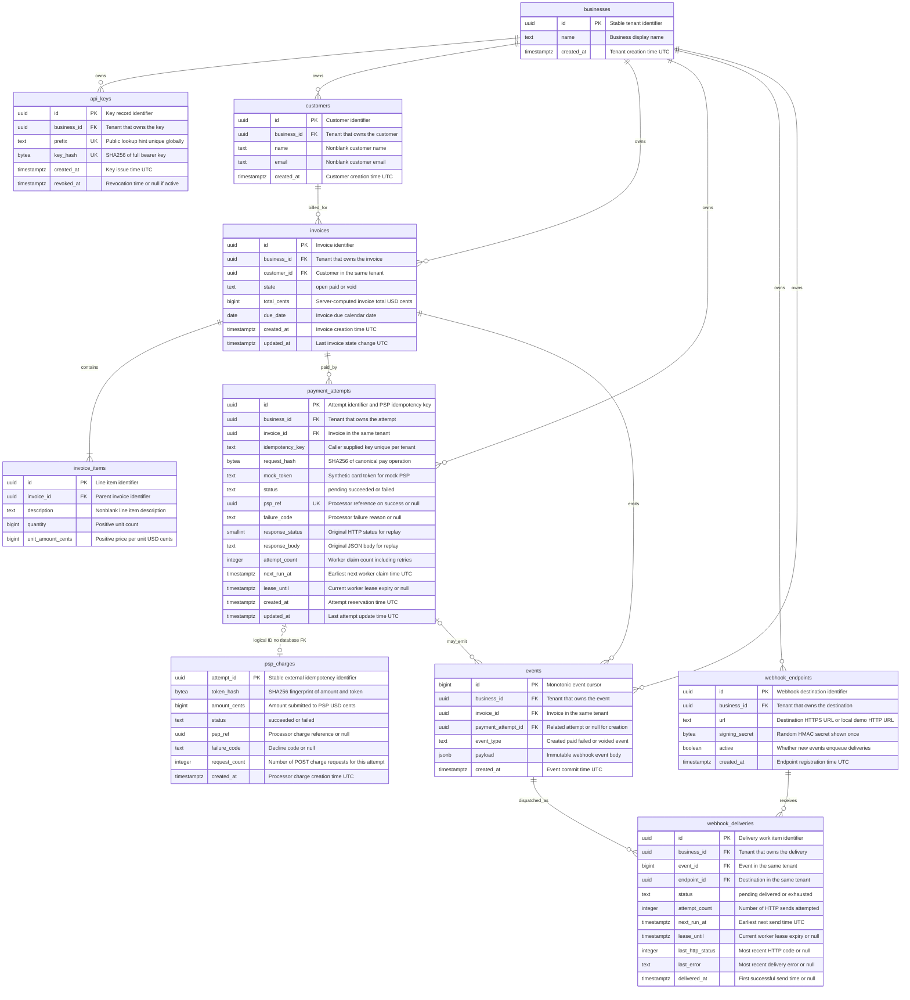

# Entity–relationship diagram

This diagram reflects `migrations/202609190001_initial.sql` and `migrations/202609190002_track_psp_charge_requests.sql`. Money is stored only in integer USD cents. The invoice item amount is `unit_amount_cents`; its extended amount is `quantity × unit_amount_cents`, computed by the API. `invoices.total_cents` is the persisted sum of those extended amounts, and `psp_charges.amount_cents` is the amount sent to the mock processor. These are deliberately distinct fields.

Additional constraints: `(business_id, customer_id)` and `(business_id, invoice_id)` composite foreign keys enforce tenant consistency; `(business_id, idempotency_key)` is unique; each invoice has at most one pending attempt through a partial unique index; `(event_id, endpoint_id)` is unique. The mock PSP's `psp_charges` table has no database foreign key to `payment_attempts` because the API must treat the PSP as an external system and reconcile through HTTP.
